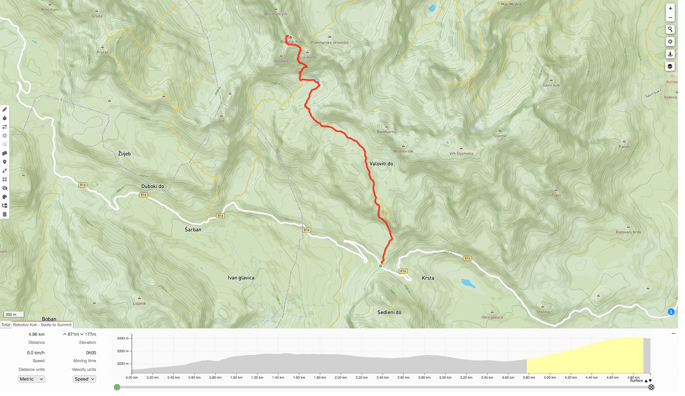
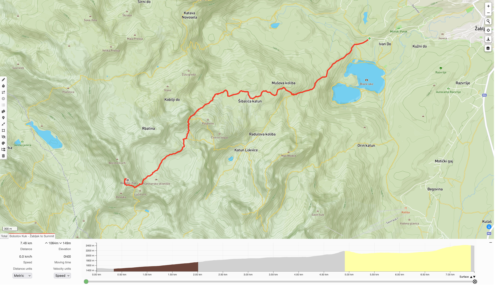

+++
title = 'Hiking Bobotov Kuk → Sedlo to Žabljak GPX Routes'
date = 2023-08-26T09:42:00
draft = false
+++

## Introduction

Eight friends and I rented a Renault Trafic from Dubrovnik this summer, and travelled along the
Croatian coast, up through Bosnia, and then back down through Montenegro. One of the highlights was
a day hike in Montenegro's [Durmitor National Park](https://en.wikipedia.org/wiki/Durmitor) - where
we set off from Sedlo at 7am, summited [Bobotov Kuk](https://en.wikipedia.org/wiki/Bobotov_Kuk)
(2523m) at around 10am, and then hiked back down to Žabljak, finishing with beer and a swim in the
[Black Lake](<https://en.wikipedia.org/wiki/Black_Lake_(Montenegro)>) (Crno Jezero) at around 4pm.

This is a quick post to share my GPX routes, as I struggled to find easily accessible free downloads
before the trip. Overall the route is very well signposted, and the Sedlo to summit part of the hike
was busy as it's a relatively easy 5 hour out and back tourist route. However, the summit to Žabljak
portion of the day was harder to navigate, and we only met a handful of other hikers on the descent.
Hope these help, and enjoy! This ended up being one of my favourite day hikes I've done so far.

## GPX Downloads

### Sedlo to Summit

Download: [GPX](bobotov-kuk-sedlo-to-summit.gpx)

### Žabljak to Summit

Download: [GPX](bobotov-kuk-zabljak-to-summit.gpx)

## Photos

I've shared photos on my Instagram from the trip, mostly shot on my Canon AF-7:

- [August 29, 2023](https://www.instagram.com/p/CwhFXZ6tIs-)
- [September 21, 2023](https://www.instagram.com/p/CxcVA4itRaq)
- [February 1, 2024](https://www.instagram.com/p/C2y7m15t9HU)

## Credits

- Thank you to [Freya](https://www.instagram.com/thesandyfeet) for this
  [post](https://thesandyfeet.com/our-guide-to-climbing-bobotov-kuk) on the different routes up
  Bobotov Kuk
- Thanks to [Andrea](https://www.instagram.com/wanderful_journeys) for this
  [post](https://www.wanderfuljourneystravel.com/the-wanderful-blog/bobotov-kuk-montenegro), which
  got us all hyped for the route
